<!-- 
Titre : Hello Clermont'ech
Date : 28/11/2014
Événement : Journée des métiers de l'informatique
Auteur : Julien Maupetit
-->

## Hello 
# Clermont'ech

Journée métiers de l'informatique - 28/11/2014

[@clermontech](https://twitter.com/clermontech)

[clermontech.org](http://clermontech.org)

<!-- Plan -->

1. Pourquoi Clermont'ech ?
2. L'association
3. El Manifesto
4. Les événements
5. Les *User Groups* sur CF

<!-- ---------- Section ---------- -->

# Pourquoi 
## Clermont'ech ?

### `/me` arrive en Auvergne

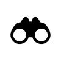

Où sont les développeurs python ?

    Crédit : <a href="http://thenounproject.com/noun/binoculars/#icon-No1625" target="_blank">Binoculars</a> designed by <a href="http://thenounproject.com/DrawPerfect" target="_blank">Paul IJsendoorn</a> from The Noun Project

## Djang'Auvergne

### Djang'Auvergne #1

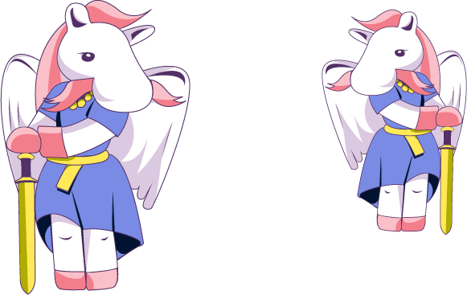

### Djang'Auvergne #2

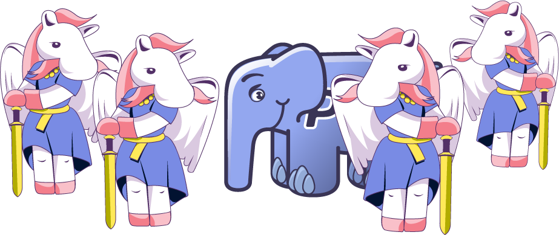

### Djang'Auvergne #3

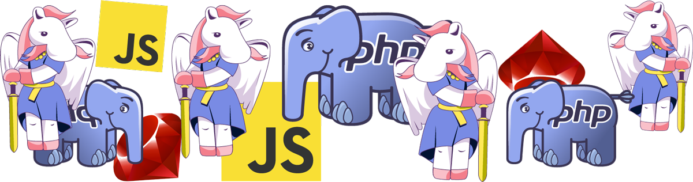

### Feb. 2012: Clermont'ech is born

<!-- ---------- Section ---------- -->

# L'association

# Clermont'ech
## est une association Loi 1901

## Bureau

* Président : [Julien Maupetit](http://julien.maupetit.me)
* Vice président : [Julien Muetton](http://muetton.me)
* Trésorier : [Pierre Tachoire](https://twitter.com/krichprollsch)
* Trésorier suppléant : [William Durand](http://williamdurand.fr)
* Secrétaire : [Manuel Raynaud](http://www.manuel-raynaud.com)
* Secrétaire suppléant : [Jean-Philippe Serafin](http://jeanphix.me/)

<!-- ---------- Section ---------- -->

# Manifesto

# Partage

# Ouverture

Clermont'ech est technologie-agnostique.

# Indépendance

Clermont’ech ne se verra jamais dicter sa ligne éditoriale par des tiers extérieurs à l’association.

# Respect

    Crédit : <a href="http://thenounproject.com/noun/handshake/#icon-No767" target="_blank">Handshake</a> designed by <a href="http://thenounproject.com/Jake_Nelsen" target="_blank">Jake Nelsen</a> from The Noun Project

<!-- ---------- Section ---------- -->

### "Mais concrètement vous faites quoi ?"

## #APIHour

* 4 talks
* 1h max.
* 50 personnes max.
* Lieu et jour variables
* Vidéos en ligne
* Fréquence : 6/8 semaines

## #APIHour 
... is the new Happy Hour

    Crédit : <a href="http://thenounproject.com/noun/beer/#icon-No12254" target="_blank">Beer</a> designed by <a href="http://thenounproject.com/jacob" target="_blank">Jacob Halton</a> from The Noun Project

## #APIHour

Proposez nous un talk !

<a href="mailto:iwanttospeak@clermontech.org">iwanttospeak@clermontech.org</a>

## Be famous!

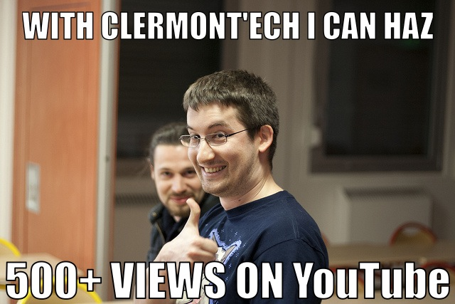

[@madmatah](https://twitter.com/madmatah) +300 vues sur YouTube en moins de 48h

## Bilan APIHours

* 11 APIHours organisés
* 44 talks (40 speakers locaux)
* 550 ornithorynques motivés
* 50 réservations : 15 minutes
* 17 sponsors
* 0€ par place

## Workshop

* Premier atelier Git le 15 novembre dernier
* De la théorie à la pratique

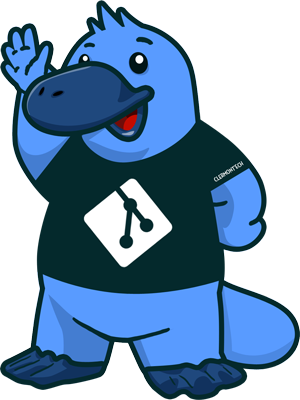

## DejDev

* Déjeuner informel
* Fédérer la communauté
* Echanger autour de nos problèmes métier

## APIHour #12 Xmas Edition

le 16 déc. 2013 à 19h à `[Fill this]` (Clermont-Ferrand)

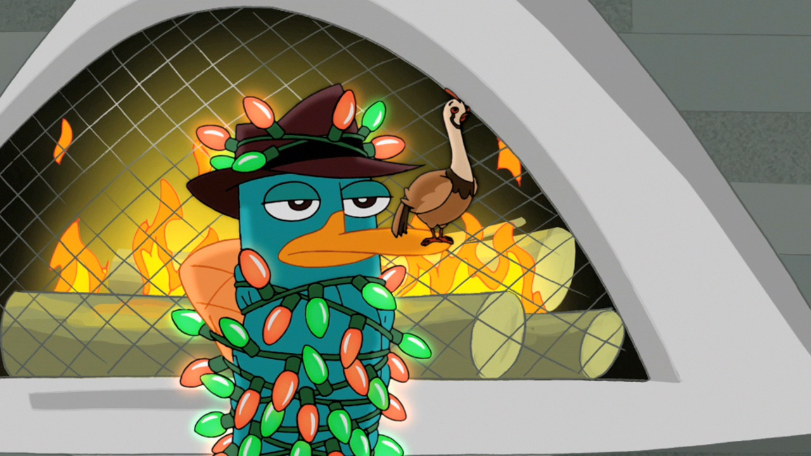

## ... what's next?

# 2015

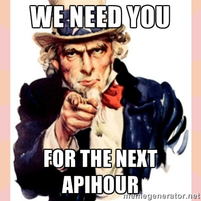

## 2015

* Workshop Sécurité
* Support à l'organisation d'événements nationaux

## DjangoCong #5

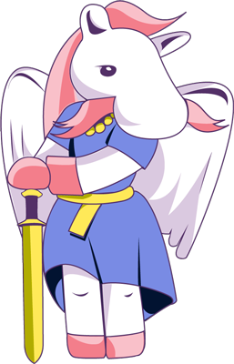

**8-10 Mai 2015**, 
Clermont-Ferrand

### Les 
# User Groups

## LavaJUG

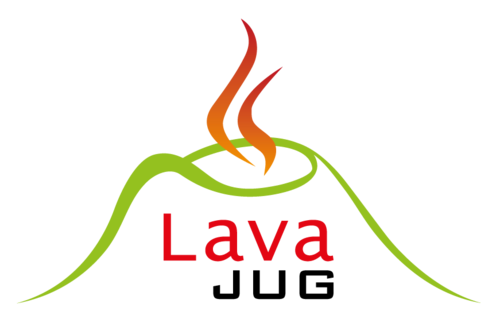

[@lavajug](https://twitter.com/lavajug)

[www.lavajug.org](http://www.lavajug.org/xwiki/bin/view/Main/WebHome)

## ClermontJS

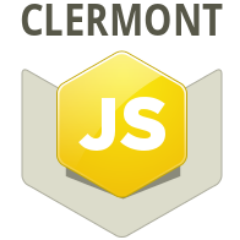

[@ClermontJS](https://twitter.com/ClermontJS)

## Clermont.rb

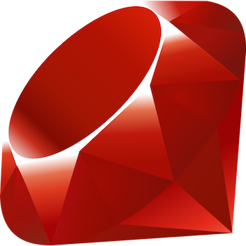

[@clermontrb](https://twitter.com/clermontrb)

## Acolab

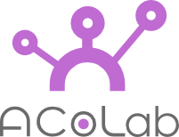

[@acolabfr](https://twitter.com/acolabfr)

[acolab.fr](http://acolab.fr)

# Merci !
