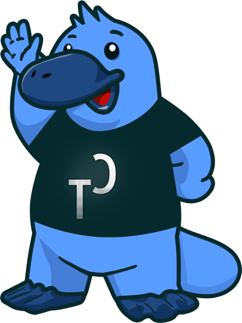
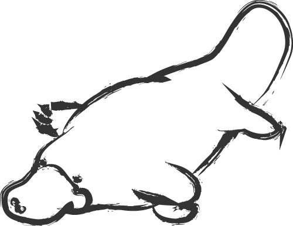
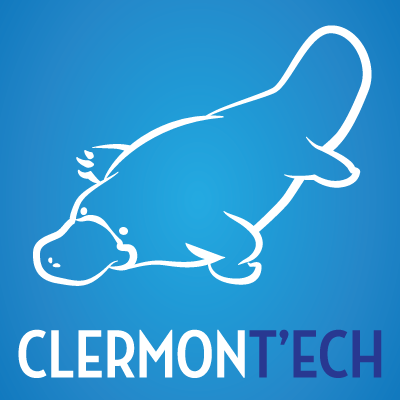
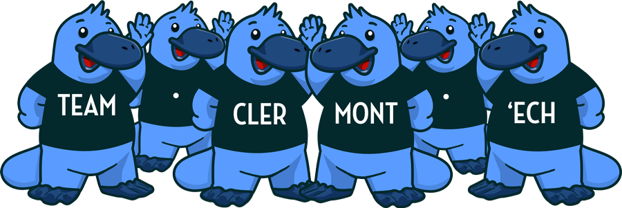

<!-- 
Titre : Hello Clermont'ech
Date : 03/04/2013
Événement : Clermontech APIHour #1
Auteur : Julien Maupetit
-->

##### L'ornithorynque sortit de l'eau et dit...
# Hello Clermont'ech !

[@clermontech](https://twitter.com/clermontech)

[clermontech.org](http://clermontech.org)

`#APIHour`

<!-- Plan -->

1. Pourquoi Clermont'ech ?
2. Les joyeux <strike>ornithorynques</strike> développeurs
3. El Manifesto
4. Le concept `#APIHour`

<!-- ---------- Section ---------- -->

# Pourquoi Clermont'ech ?

### `/me` arrive en Auvergne

### DjangAuvergne

### Clermont'ech is born

<!-- ---------- Section ---------- -->

# Les joyeux développeurs

# Clermont'ech
## est une association Loi 1901

## Bureau

* Président : [Julien Maupetit](http://julien.maupetit.me)
* Vice président : Julien Muetton
* Trésorier : Pierre Tachoire
* Trésorier suppléant : [William Durand](http://williamdurand.fr)
* Secrétaire : [Manuel Raynaud](http://www.manuel-raynaud.com)
* Secrétaire suppléant : [Jean-Philippe Serafin](http://jeanphix.me/)

<!-- ---------- Section ---------- -->

# Manifeste Clermont'ech

# Ouverture

Clermont'ech est technologie-agnostique.

# Indépendance

Clermont’ech ne se verra jamais dicter sa ligne éditoriale par des tiers extérieurs à l’association.

# Respect

    Crédit: <a href="http://thenounproject.com/noun/handshake/#icon-No767" target="_blank">Handshake</a> designed by <a href="http://thenounproject.com/Jake_Nelsen" target="_blank">Jake Nelsen</a> from The Noun Project

# Partage

<!-- ---------- Section ---------- -->

# #APIHour

## #APIHour

* 4 talks
* 1h max.
* 50 personnes max.
* Lieu variable

Souriez, vous êtes filmés

## #APIHour 
... is the new Happy Hour

    Crédit: <a href="http://thenounproject.com/noun/beer/#icon-No12254" target="_blank">Beer</a> designed by <a href="http://thenounproject.com/jacob" target="_blank">Jacob Halton</a> from The Noun Project

## Merci

[Sophie Navas](http://www.sophienavas.fr/) - [@agou](https://www.twitter.com/agou) est à l'origine de notre identité visuelle (logo & mascotte)

SupInfo pour leur accueil

